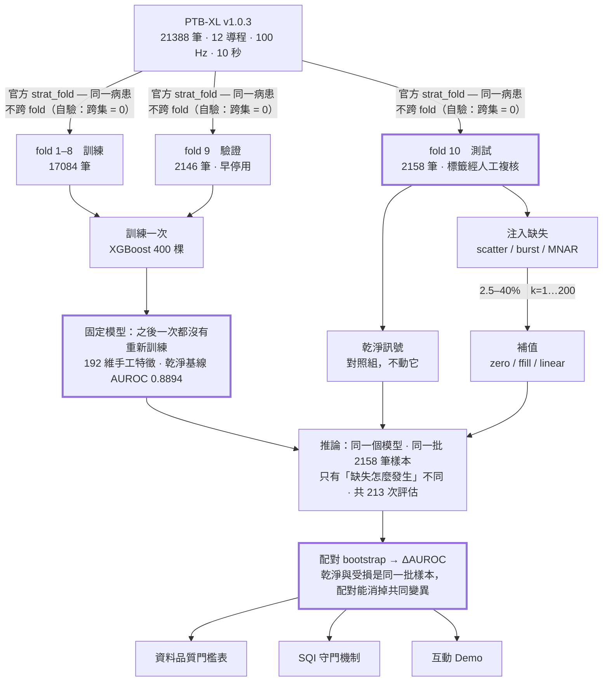
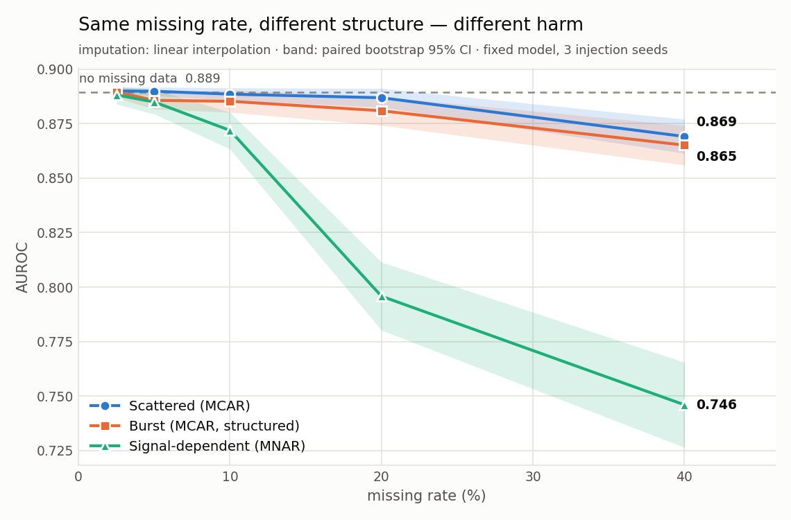
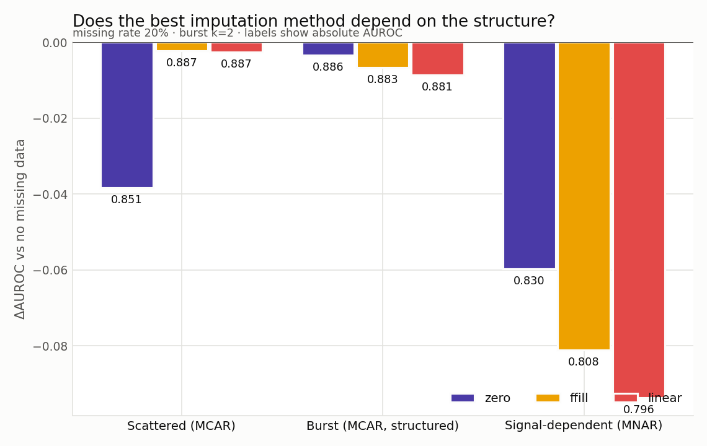
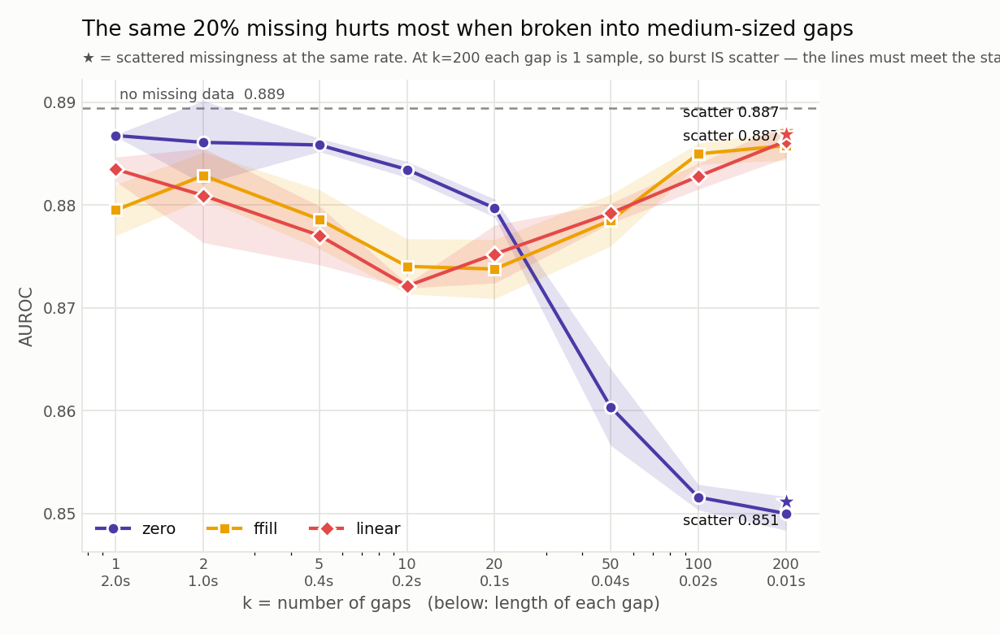
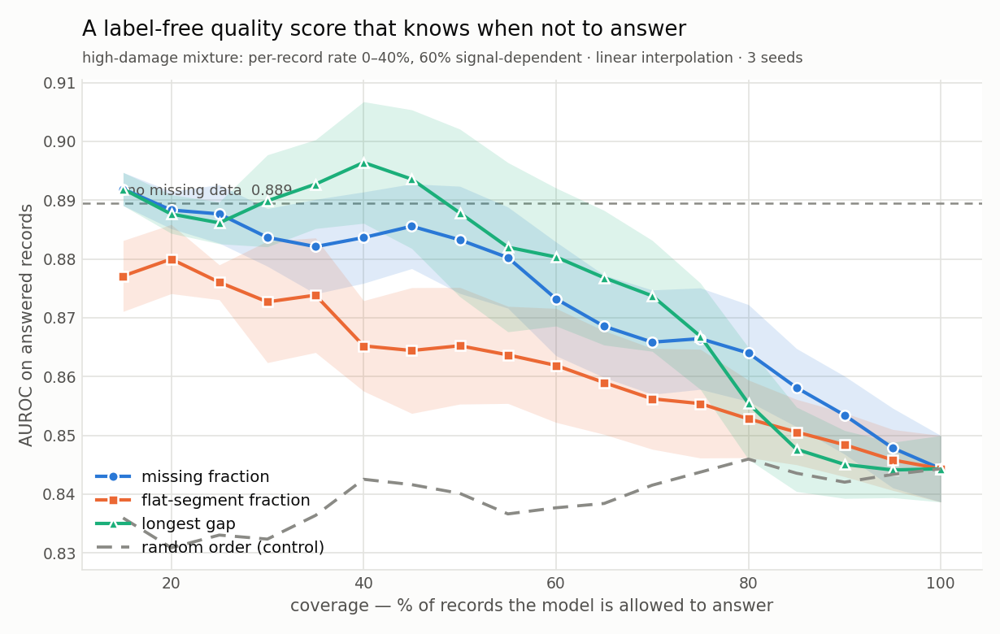
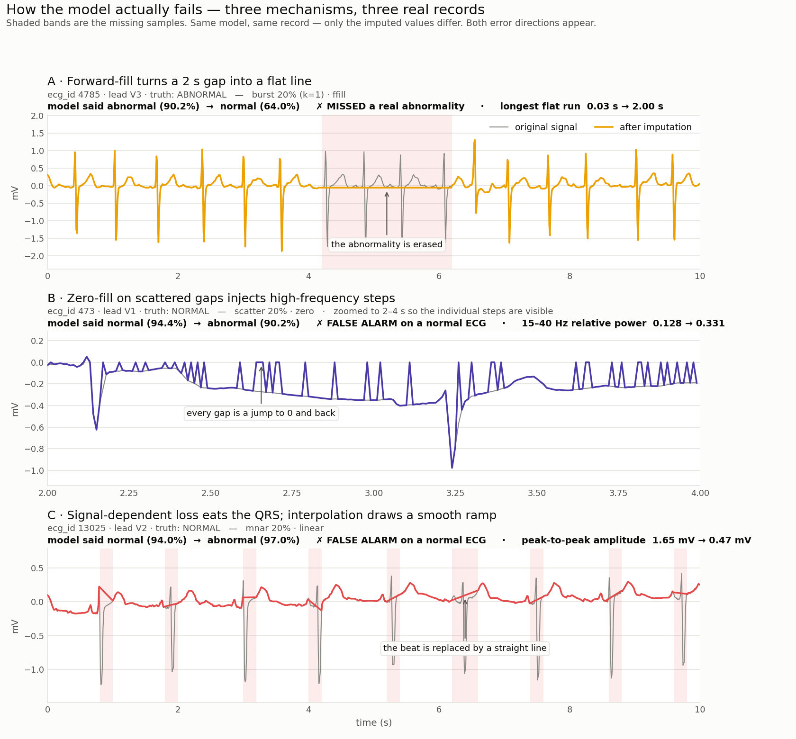
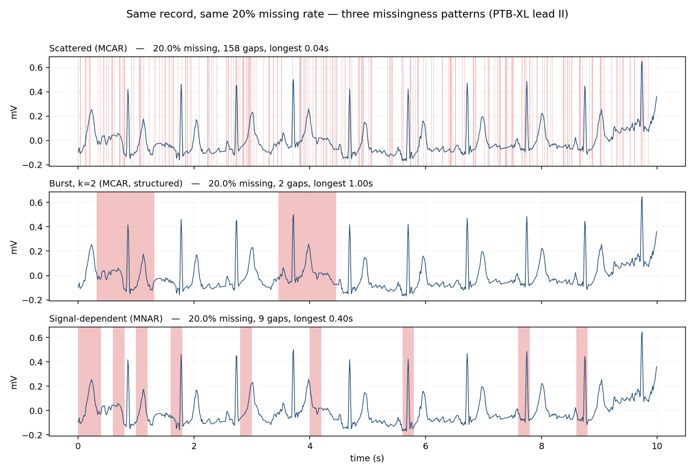

# 缺失結構的傷害地圖 — Missingness Structure Harm Map

> **臨床訊號的缺失不是隨機的，但補值方法的評估幾乎都假設它是。**
> 這個專案量化「缺失的結構」對下游模型的傷害，並給出一組可操作的資料品質門檻。

---

## 整條路



這張圖要說的只有一件事：**模型只訓練一次就凍結，缺失只在測試端注入，
而乾淨與受損走的是同一個模型、同一批樣本**——所以兩邊可以配對比較。

如果每換一種缺失型態就重新訓練一次模型，量到的就會是「模型能不能學會適應缺失」，
而不是「既有模型碰到缺失會壞成什麼樣」——後者才是臨床部署真正會遇到的情況。

| 變因 | 掃過的值 | 為什麼是這些值 |
|---|---|---|
| 缺失型態 | scatter / burst / MNAR | 前兩者統計上**同屬 MCAR**，只有空間結構不同；第三種才換機制 |
| 缺失率 | 2.5 / 5 / 10 / 20 / 40 % | 含 2.5%，讓門檻表涵蓋臨床常見的低缺失操作點 |
| 缺口段數 k | 1 / 2 / 5 / 10 / 20 … 200 | 錨定在心電圖自己的尺度：RR 間期中位數 0.84 s、QRS 寬度 0.12 s |
| 補值方法 | zero / ffill / linear | 零填補是參照點——它等於「用平均值預測」，是理論地板 |
| 注入 seed | 0 / 1 / 2 | 誤差帶反映「缺口剛好落在哪裡」，不是訓練的隨機性 |

---

## 主要發現



**1. 真正的分水嶺不是「連續 vs 散布」，而是「缺失有沒有挑地方發生」。**
同樣缺 20%，隨機散布只讓 AUROC 掉 0.003，連續大段掉 0.009（3.4 倍），
但**訊號相關（MNAR）的缺失掉了 0.094 —— 是隨機缺的 37 倍**。
缺 40% 時 MNAR 讓 AUROC 從 0.889 掉到 0.746。

這解釋了為什麼用隨機遮罩評估補值方法會低估風險：
**隨機遮罩剛好落在傷害最小的那一端。**

**2. 最好的補值方法會隨缺失結構翻轉——沒有一種方法在所有情況下都對。**



| 缺失 20% | 零填補 | 前值填補 | 線性內插 |
|---|---|---|---|
| 散布 | **−0.038**（最差） | −0.002 | −0.003 |
| 連續 | **−0.003**（最好） | −0.007 | −0.009 |
| 訊號相關 | **−0.060**（最好） | −0.081 | −0.094 |

零填補在散布型是最差的選擇，在連續型與 MNAR 卻是最好的。
機制是可驗證的：散布型下零填補會在每個缺失點製造高頻人工不連續，
而模型第二重要的特徵正是 15–40 Hz 的相對功率。

> 實務建議是反直覺的：**缺失越集中、越與訊號相關，越不該用內插去「猜」。**

**3. 同樣的缺失量，切成中等大小的缺口時傷害最大。**



固定 20% 缺失，把它切成 k 段：傷害在 **k≈5–20（缺口長度 0.1–0.4 秒）** 時最大，
兩端都比較小。k=200 時每段缺口只有 1 個取樣點，依定義就等於散布型——
曲線右端確實收斂到散布型的參考點（★），這是注入器邏輯的閉環驗證。

**這個非單調現象我們還沒有能解釋的機制。** 依序檢驗了三個假設
（被破壞的心搏比例、受影響範圍 × 重建誤差的乘積、特徵空間位移量），
**全部被自己的資料否證**——檢驗過程與數據見 [`notes/process_and_decisions.md`](notes/process_and_decisions.md)。

**4. 一個不看標籤的品質分數，可以在資料不夠好時讓模型閉嘴。**



在高傷害情境（逐筆缺失率 0–40%、六成為 MNAR，整體 AUROC 掉到 0.847）下，
用「最長缺口」或「缺失比例」排序後只回答品質最好的前 40%，AUROC 回到 0.89 附近，
**明顯高於隨機排序的對照組**。

> 但要誠實兩件事：(a) 覆蓋 40% 時的 0.896 高於乾淨基線，那是**選樣效應**，
> 不是守門讓模型變強；(b) 逐筆相關係數不大（ρ≈0.06–0.16），
> 守門有效是因為**排序方向對**，不是每一筆都預測得準。

---

## 模型是怎麼壞的

平均傷害有多大是上面那些曲線在回答。**這一張回答的是「它壞掉的時候，到底發生了什麼事」**——
三個真實個案，三種不同的機制，兩個方向的錯誤都有。



| | 機制 | 可量測的指紋 | 後果 |
|---|---|---|---|
| **A** | 前值填補把 2 秒缺口拉成一條水平線，**異常波形連同缺口一起被抹平** | 最長平坦段 0.03 s → **2.00 s** | 90.2% 確定異常 → 64.0% 確定正常，**漏診** |
| **B** | 零填補在每個散布的缺點製造一次「跳到 0 再跳回來」 | 15–40 Hz 相對功率 0.128 → **0.331** | 94.4% 確定正常 → 90.2% 確定異常，誤警報 |
| **C** | 訊號相關缺失優先吃掉高振幅的 QRS，線性內插畫出一條平滑斜坡代替心搏 | 峰對峰振幅 1.65 mV → **0.47 mV** | 94.0% 確定正常 → 97.0% 確定異常，誤警報 |

三件值得注意的事：

1. **B 的指紋直接證實了機制。** 前面說「零填補在散布型最差，是因為它製造高頻人工不連續，
   而 15–40 Hz 相對功率是模型第二重要的特徵」——這裡量到的是**同一條訊號**上該頻帶功率
   從 0.128 跳到 0.331（2.6 倍）。這不是看圖說故事。
2. **傷害是雙向的。** A 是把真實的異常抹掉（漏診），B 和 C 是在正常心電圖上叫出異常（誤警報）。
   前者在臨床上更危險，而且**補值補得越「平滑」越容易發生**。
3. **模型在每一個個案裡都很有信心。** 沒有任何一次它表現出猶豫——
   這正是整個專案的論點：**光看模型自己的信心，看不出資料已經壞了。**

完整數字見 [`results/m6_failure_cases.csv`](results/m6_failure_cases.csv)。

---

## 資料品質門檻表

基準：無缺失時 AUROC = **0.8894**（PTB-XL fold 10，2158 筆，固定模型）

**容忍上限 ΔAUROC < 0.03**

| 缺失型態 | 最大可接受比例 | 建議補值 | 超過時的建議 |
|---|---|---|---|
| 隨機散布 | **40%** | 前值填補或線性內插 | 資料仍可用，但改用內插 |
| 連續大段 | **40%** | **零填補** | 不要用內插；改填中性值 |
| 訊號相關 | **10%** | **零填補** | **標記為不可用**，或改走守門機制 |

**容忍上限 ΔAUROC < 0.01**：散布 20%、連續 20%、訊號相關 10%。

完整表格見 [`results/m6_threshold_table.md`](results/m6_threshold_table.md)。

---

## 互動 Demo

> 🔗 **線上版：** https://ecg-missingness-m98wsaetaho2secxdgtzpg.streamlit.app
>
> 部署在 Streamlit Community Cloud。閒置一段時間後 app 會休眠，
> 第一位訪客可能看到喚醒畫面，按一下等約 30 秒即可。

```bash
pip install -r demo/requirements.txt
streamlit run demo/app.py
```

Demo 只用 **40 筆預先存好的代表樣本**（int16 µV 無損，0.67 MB），資料集本身不進 repo。

**每一個控制項在動什麼、每一個數字看到多少算好，見 [`demo/GUIDE.md`](demo/GUIDE.md)。**

拉動缺失率滑桿，介面會即時算出這個設定下的預期 AUROC 損失，
**超過容忍上限時直接跳出「此資料品質不足，預測不可信」**——這個互動就是整個專案的論點。

三個值得動手試的設定：

1. **樣本 #10（ecg_id=5753）、訊號相關 MNAR、20% 缺失** ——
   乾淨時模型 99.1% 確定這是**正常**心電圖；注入缺失後翻成 75.7% 確定是**異常**。
   同一筆資料、同一個模型，只因為缺了 20%，結論就跳到另一邊，
   **而模型本身不會告訴你這件事發生了。**
2. **隨機散布 + 零填補** → 損失 0.038（最差）；**切到連續大段** → 損失 0.003（最好）。
   同一個補值方法，換個缺失結構就從最差變最好。
3. **連續大段，把 k 從 1 拉到 50** —— 同樣缺 20%，中等碎裂程度傷害最大。

---

## 這個問題從哪來

在醫院產學合作處理血液透析資料時，需要對靜脈壓與跨膜壓做補值。
實際觀察到的缺口不是隨機散落的單點，而是機器暫停、警報、護理操作造成的**連續大段**。
但補值方法的評估文獻幾乎清一色用隨機遮蔽。

用心電圖來回答，是因為它乾淨、完整、有公開基準，可以**完全控制缺失怎麼發生**——
在真實透析資料上，沒辦法把缺失「關掉」再重做一次。

缺失型態的參數錨定在心電圖自己的生理尺度上：對測試集 2158 筆做 R 波偵測，
量得 RR 間期中位數 0.84 秒（71 bpm），因此每個 k 值都能換算成
「一個缺口吃掉幾個心動週期」。錨定的完整推導見
[`notes/process_and_decisions.md`](notes/process_and_decisions.md)。



---

## 資料與方法

**資料**：[PTB-XL v1.0.3](https://physionet.org/content/ptb-xl/1.0.3/)，只用 `records100`（100Hz、10 秒、12 導程）。

- **標籤**：二元分類，NORM（完全正常）vs 任何其他診斷類別。21388 筆有診斷標籤，異常比例 57.6%。
- **切分**：官方 `strat_fold`——fold 1–8 訓練、9 驗證、10 測試。官方切分保證**同一病患不跨集**，
  且 fold 9/10 經過人工複核、標籤品質最高。我們另外自行驗證：**跨集病患數 = 0**。
- **驗證**：我們算出的五大類記錄數（NORM 9514 / MI 5469 / STTC 5235 / CD 4898 / HYP 2649）
  與官方頁面公布的數字**完全一致**。

**模型**：192 維手工特徵（每導程 16 個 × 12 導程）+ XGBoost。
所有特徵逐筆逐導程獨立計算，**結構上不可能發生標準化洩漏**。
無缺失基線 AUROC = 0.8912 ± 0.0024（3 seeds），bootstrap SE = 0.0065。

**實驗設計**：情境 A（訓練用乾淨資料，測試注入缺失），**固定模型不重新訓練**，
因此誤差帶反映的是「缺口剛好落在哪裡」的隨機性。
乾淨與受損是同一批樣本、同一個模型，故 ΔAUROC 採**配對 bootstrap**。
共 213 次評估。

---

## 專案結構

```
ecg-missingness/
├── config.py                     全域路徑與參數
├── src/
│   ├── data.py                   標籤映射、官方切分、波形快取
│   ├── features.py               192 維特徵（分批處理）
│   ├── missingness.py            缺失注入器（三種型態）★ 核心模組
│   ├── imputation.py             三種補值方法
│   └── model.py                  XGBoost 訓練與評估
├── scripts/
│   ├── m1_build_cache.py         資料與標籤、開發子集快取
│   ├── m1b_build_full_cache.py   全量快取（int16 µV，無損）
│   ├── m2_baseline.py            基線模型
│   ├── m3_injector.py            注入器的三項驗證＋三宮格圖
│   ├── m4_imputation.py          補值正確性＋訊號層重建誤差
│   ├── m5_experiments.py         主實驗（135＋45 次評估）
│   ├── m5b_followups.py          延長碎裂掃描、機制檢驗、SQI 重設計
│   ├── m5c_mechanism_and_gate.py 機制假設檢驗、高傷害守門實驗
│   ├── m6_final_figures_and_table.py  最終圖與門檻表
│   └── m6_failure_cases.py       失效個案圖（三種機制各一個真實個案）
├── demo/
│   ├── app.py                    Streamlit 互動 demo
│   ├── GUIDE.md                  操作與判讀說明（白話／技術兩層）
│   ├── sample_pack.npz           40 筆代表樣本（int16 µV，0.67 MB）
│   ├── model.json                M2 的固定模型（XGBoost 原生格式，跨版本相容）
│   ├── model.joblib              同一個模型的 pickle 版（退路）
│   └── harm_table.csv            預先算好的傷害曲線
├── notes/
│   └── process_and_decisions.md  ★ 每個決策的依據、驗證、被否證的假設
├── results/                      runs.parquet、各項驗證表
└── figures/
```

## 重現步驟

```bash
pip install -r requirements.txt
# 下載 PTB-XL v1.0.3，把路徑填進 config.py 的 PTBXL_ROOT
python scripts/m1_build_cache.py         # 標籤、切分、開發子集
python scripts/m1b_build_full_cache.py   # 全量快取（約 8 分鐘）
python scripts/m2_baseline.py full       # 基線模型
python scripts/m3_injector.py            # 注入器驗證
python scripts/m4_imputation.py          # 補值驗證
python scripts/m5_experiments.py         # 主實驗（約 67 分鐘）
python scripts/m5b_followups.py
python scripts/m5c_mechanism_and_gate.py
python scripts/m6_final_figures_and_table.py
python scripts/m6_failure_cases.py      # 失效個案圖
streamlit run demo/app.py            # 互動 demo
```

---

## 限制

1. **結論在單一資料集、單一模態上驗證，跨模態推廣性未測試。**
   透析資料的缺口長度分布未知，因此 k 的錨點來自心電圖生理尺度而非透析事件時長。
2. **我們假設遮罩是已知的。** 真實資料中缺失以異常值或空值呈現，
   要先由人或演算法判斷哪些不可用——**偵測是補值之前的另一個問題**。
   本研究量化的是「已知缺失」造成的傷害下界；真實傷害只會更大。
3. **使用 100Hz 降取樣版本**，高頻細節本已損失一部分，絕對數值可能低估。
   但所有條件都在同一取樣率下比較，型態之間的相對差異仍然成立。
4. **碎裂曲線的非單調性目前無法解釋**，三個假設皆被自己的資料否證（見 `notes/process_and_decisions.md`）。
5. **模型是手工特徵 + XGBoost，不是深度模型。** 深度模型對缺失的反應可能不同。

---

## 授權與資料

程式碼以 MIT 授權釋出（見 [`LICENSE`](LICENSE)）。

**本 repo 不包含 PTB-XL 資料集。** 資料由 PhysioNet 以 CC BY 4.0 釋出，
請自行從 [physionet.org](https://physionet.org/content/ptb-xl/1.0.3/) 下載。
`demo/sample_pack.npz` 是為了讓互動 demo 可執行而擷取的 40 筆樣本，
同樣依 CC BY 4.0 釋出，原始資料引用：

> Wagner, P., Strodthoff, N., Bousseljot, R.-D., et al.
> *PTB-XL, a large publicly available electrocardiography dataset.*
> Scientific Data 7, 154 (2020).

